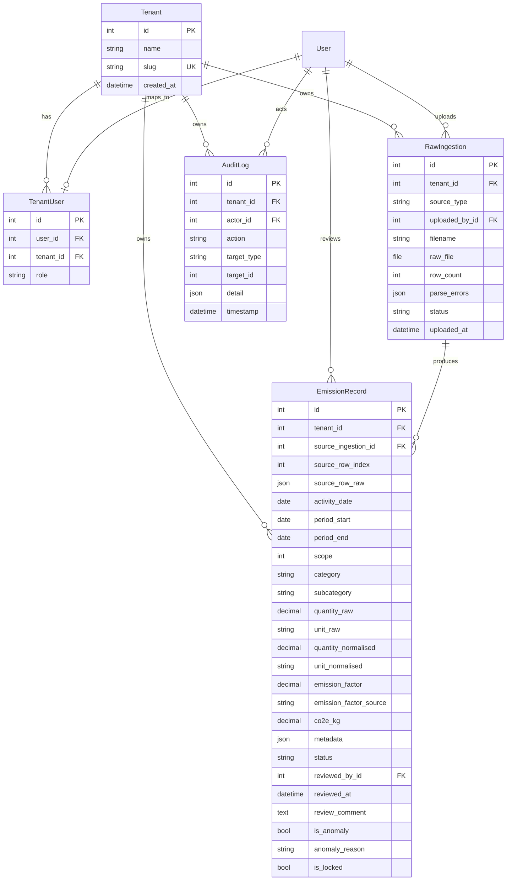

# Data Model Design — MODEL.md

## ER Diagram



## Multi-Tenancy Approach

Every data model carries a **`tenant` ForeignKey** to `Tenant`. Querysets are filtered by the authenticated user's tenant (via `TenantUser`) in every view. This is a simple shared-database, shared-schema approach suitable for a prototype.

**Why FK-based, not schema-per-tenant:**
- Simpler migrations — one schema to manage
- Cheaper on managed databases (Render Postgres free tier has 1 database)
- Sufficient for the review/audit use case where cross-tenant queries aren't needed

## Scope 1 / 2 / 3 Categorisation Logic

| Source       | Material/Type                  | Scope | Rationale                                    |
|-------------|-------------------------------|-------|----------------------------------------------|
| SAP         | ROE, ROG, ROB, ROK, ROL       | 1     | Direct fuel combustion at owned facilities   |
| SAP         | ELE*, ELEK, STR               | 2     | Purchased electricity                        |
| Utility     | All records                    | 2     | Grid electricity consumption                 |
| Travel      | AIR, CAR, RAIL, TAXI, HOTEL   | 3     | Business travel (upstream, not owned)        |

## Source-of-Truth Tracking

```
RawIngestion (immutable file record)
    └── EmissionRecord.source_ingestion (FK)
        ├── source_row_index (which row in the file)
        └── source_row_raw (exact dict before any transformation)
```

This means any normalised value can be traced back to the exact original data. Auditors can verify that `quantity_raw=5000 L` of diesel became `quantity_normalised=50000 kWh` using the documented conversion factor.

## Unit Normalisation Strategy

We store **both** raw and normalised values:

- `quantity_raw` + `unit_raw`: Exactly as received
- `quantity_normalised` + `unit_normalised`: Converted to standard units (kWh for energy, km for distance, nights for hotels)

Conversion tables are in `apps/ingestion/normalizers/units.py` with factors sourced from engineering references and DEFRA.

## Audit Trail Design

- **`AuditLog`** is **append-only** — no update or delete operations
- Every action (UPLOAD, APPROVE, REJECT, EDIT, FLAG, LOCK) creates a new row
- `detail` JSON stores before/after state for edits
- `is_locked` on `EmissionRecord` prevents any further changes after sign-off

## Future Improvements

With more time, I would add:

1. **Table partitioning** by `activity_date` for large datasets
2. **Event sourcing** — replace `updated_at` with a full event log per record
3. **Row-level security** via PostgreSQL RLS policies instead of application-level tenant filtering
4. **Soft deletes** instead of cascading deletes on tenant removal
5. **Versioned emission factors** — factor tables with effective date ranges
